# Architecture — from simulation to real

> **Status (updated for v2.0.0-beta).** The real system described below is
> **built and shipping.** The headless engine (`engine/`) drives a real
> Sense → Build → Verify → Reflect → Merge loop: BYO-LLM (Anthropic /
> OpenAI-compatible), a generic tool-use Build loop, shadow-branch git, a
> workspace-root fs guard, real command execution behind explicit consent
> (locally or in an isolated container), BYO-agent MCP tools, and a human-gated
> merge — all provider-agnostic and covered by a network-free test suite. The
> desktop app (`src-tauri/`, a Tauri shell) manages the engine as a sidecar.
>
> The **in-browser experience remains a scripted demo** by necessity — a browser
> can't run Node's fs/git/child_process — so `src/scenario.ts` + `src/loop/script.ts`
> drive one built-in mission, and its Verify phase runs the change in a
> QuickJS-on-WebAssembly sandbox (`src/wasm/verify.ts`) for a real, measured
> result. This document maps how the two fit together and the contracts that let
> **you bring your own agents and your own models**. It is written for
> contributors: everything here is open to proposal and change.

## The one principle everything follows

**Sutra is a conductor, not a crew.** It owns the *loop* — Sense → Build → Verify →
Reflect, the human gates, the iteration budget, the flight recorder, the review and
governance surfaces. It does **not** own the intelligence. Agents and language models
are plugged in behind typed contracts. We provide the framework and the seams; you
bring the agents and the LLMs.

That single decision is what keeps Sutra provider-agnostic, self-hostable, and free of
lock-in — and it is why "add your own agent / your own model" is an architecture
choice, not a feature bolted on later.

## Three planes

```mermaid
flowchart LR
  subgraph Control["Control plane — the loop (ours)"]
    L["useLoop reducer<br/>phases · gates · budget<br/>Hermes routing · flight recorder"]
  end
  subgraph Agents["Agent plane — the intelligence (yours)"]
    A1["MCP agents"]
    A2["HTTP / webhook agents"]
    A3["Local process agents<br/>(desktop)"]
    A4["Direct LLM calls<br/>via provider adapter"]
  end
  subgraph Compute["Compute plane — verify & build (pluggable)"]
    C1["WASM sandbox<br/>(QuickJS today)"]
    C2["Container runner<br/>(Docker / Firecracker)"]
    C3["Ephemeral cloud sandbox<br/>(E2B · Daytona · Codespaces)"]
    C4["Your CI<br/>(GitHub Actions …)"]
  end
  L -->|dispatch work| Agents
  Agents -->|proposed change| L
  L -->|run acceptance signals| Compute
  Compute -->|measured results| L
```



- **Control plane** is what exists today: a small, deterministic reducer
  (`src/loop/useLoop.ts`). It is cheap and can stay client-side, or move into a small
  orchestrator service for team runs (see *Hosting*). This is the product's moat and
  it barely changes as everything else becomes real.
- **Agent plane** is where real intelligence runs. It is reached only through
  adapters, so no agent implementation leaks into the core.
- **Compute plane** is where a change is actually executed and measured. WASM is the
  default because it is sandboxed, offline and byte-identical everywhere; heavier or
  multi-language work swaps in a container or a remote sandbox behind the same
  interface.

## Bring your own agents (BYO-agent)

> These contracts now exist as real, compiling TypeScript in
> [`src/contracts/`](src/contracts/) (`agent.ts`, `llm.ts`, `registry.ts`, plus a
> reference implementation in `simulated.ts`). The snippets below are illustrative;
> the files are the source of truth — and still open to proposals.

An agent is a **manifest plus a transport** — never code baked into Sutra.

```jsonc
// agent manifest (illustrative — the schema is a design target, open to proposals)
{
  "id": "builder-a",
  "role": "builder",              // scout | builder | verifier | sentinel | courier | custom
  "transport": "mcp",             // mcp | http | process
  "endpoint": "stdio://./agents/builder",   // or https://…, or a local command
  "capabilities": ["edit-code", "write-tests"],
  "phases": ["build"],            // which loop phases it may serve
  "model": "ref:profiles.strong" // which BYO-LLM profile it uses, if any
}
```

- **Registry.** Users add agents in-app; the set lives in *their* config (local file
  on desktop, user-owned store on web) — not in this repo.
- **Routing.** A loop phase declares the capabilities it needs. Hermes (the courier)
  routes each iteration's directive to any registered agent that satisfies them. The
  scripted crew (Scout, Builders, Verifier, Sentinel, Hermes) becomes the *default*
  set you can replace one agent at a time.
- **Primary integration surface: MCP.** Model Context Protocol is the first-class
  transport — an MCP server that speaks the agent contract joins the crew with no
  Sutra-side code. HTTP and local-process adapters cover everything else.

## Bring your own LLM (BYO-LLM)

Models sit behind one normalized **provider adapter** so a role can target any of them:

```ts
// provider adapter (design target)
interface LlmProvider {
  id: string                                   // 'anthropic' | 'openai' | 'ollama' | 'openai-compat' | …
  complete(req: { messages: Msg[]; tools?: Tool[]; opts?: GenOpts }): Promise<Completion>
}
```

- **Any provider.** Anthropic, OpenAI, Google, Mistral, or anything
  OpenAI-compatible; fully local via Ollama / llama.cpp / LM Studio. Local models mean
  the loop can run offline end to end.
- **Per-role model routing.** Cheap model for Sense, a strong model for Build, etc.,
  each with its own budget cap — declared as profiles the manifests reference.
- **Keys never touch the repo.** By deployment:
  - **Desktop (Tauri):** keys in the OS keychain (Keychain / Credential Manager /
    libsecret). Best posture.
  - **Web:** a user-owned key proxy, or client-side keys encrypted at rest behind a
    passphrase — with the honest caveat that browser-held keys are only as safe as the
    browser. We will never proxy keys through a Sutra-operated server by default.

## Where the files live

The unit of work is a **workspace** (a repo / working copy). Storage is chosen by
deployment, not hard-wired:

| Deployment | Files live in | Verify runs on | Notes |
| --- | --- | --- | --- |
| **Desktop (Tauri)** | real local filesystem + real `git` | local toolchains + WASM | Highest fidelity — agents read/write actual files. The honest "IDE" story. |
| **Web · ephemeral** | in-browser OPFS / File System Access API + `isomorphic-git` | WASM in the tab | No server, fully private, limited toolchains. |
| **Web · connected** | your GitHub repo via OAuth; changes land as branches / PRs | your CI or a cloud sandbox | Matches the existing **Merge** stage. |
| **Web · remote sandbox** | ephemeral cloud workspace (E2B · Daytona · Codespaces) | that sandbox | Full toolchains without a local install. |

Loop state — the flight-recorder events, loop config, Hermes memos — persists locally
(IndexedDB on web, SQLite on desktop) or in a small **user-owned** backend. **No
central data collection by default**; privacy is a design constraint, in line with the
Analogy Architect ethos.

## Hosting & management

- **The app we ship** is a static site + IDE (this repo) → Vercel / Netlify /
  Cloudflare Pages (see [`DEPLOY.md`](DEPLOY.md)). In the BYO-everything model the
  browser or desktop app talks **directly** to your agents and models, so the demo and
  single-user product need **no backend at all**.
- **Optional orchestrator service** (teams): a small, stateless service that holds the
  control plane for multi-user runs, brokers agent connections, and runs governance +
  audit. **Self-hostable via Docker** so orgs keep data in their own VPC. Open source,
  so there is no vendor to trust.
- **Secrets & auth:** user-owned. BYO-key for individuals; for teams, an org vault —
  or bring your own (Vault / Doppler / cloud KMS) behind an adapter.
- **Runners:** compute is an adapter — local, your CI, or ephemeral cloud sandboxes.
  Sutra never forces a compute vendor.

## The roadmap: simulation → real

The detailed, sequenced engineering plan — phase-by-phase deliverables, acceptance
criteria, the risk register, and why the sequencing is what it is — lives in
[`ROADMAP.md`](ROADMAP.md). Short version: a headless engine (real files, real git,
real LLM calls, real test runs) is proven from a CLI *before* it's wired into a desktop
app, and every phase ships something independently useful rather than an inert slice.

## What does *not* change

The loop model, the human gates and iteration budget, the flight recorder, the review
surface, the governance gate, and the design system are all provider-agnostic. They
are the actual product. Everything above swaps intelligence, compute and storage in
behind contracts **without touching that core** — which is exactly why a contributor
can add a single adapter and move one piece from "simulated" to "real" on its own.

---

*Have a better cut at any of these contracts? That is precisely the kind of
contribution this project wants — open an issue or a PR.*
