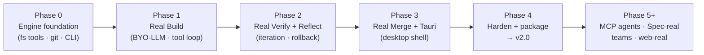

# Roadmap — from concept demo to v2.0

> **Status: FROZEN (rev 2, 2026-07-18).** This is the agreed plan of record. The
> frozen parts are the **phase boundaries, their sequencing, the hard invariants**
> (human-gated merge, workspace-root constraint, day-one cost caps) **and the v2.0
> version target**. Changing any of those requires a PR that edits this document and
> says why — not a drive-by decision inside an implementation PR. Wording fixes,
> clarifications and marking things done are normal PRs.
>
> **Progress:** Phases 0–4 are **code-complete** — every engineering
> deliverable across all five milestones is built, tested, and merged
> ([#21](https://github.com/chetanparab/sutra/pull/21) through
> [#48](https://github.com/chetanparab/sutra/pull/48)). Phase 4 added error-path
> coverage, the prompt-injection defense + hostile-repo regression, the engine
> regression gate in CI, autopilot restricted in real mode, a 4-platform release
> workflow, first-run onboarding, and a written security-review sign-off
> ([`engine/SECURITY-REVIEW.md`](engine/SECURITY-REVIEW.md)).
>
> **Two things gate the tags, and both need a human — they cannot be done in
> code:** (1) the **acceptance run** for `v2.0.0-beta.1` — a real repo → real
> loop → real branch session in the desktop app (`npm run desktop:dev`) with a
> real API key; (2) **signing certificates** (Apple Developer + Windows) as repo
> secrets for the `v2.0.0` signed/notarized installers (issue
> [#42](https://github.com/chetanparab/sutra/issues/42)). The release workflow
> already produces unsigned installers today and turns signed the moment those
> secrets exist.
>
> **What this document is.** [`ARCHITECTURE.md`](ARCHITECTURE.md) explains the
> *contracts* — the seams between the loop (ours) and the intelligence (yours). This
> document is the *engineering plan*: in what order we build the real system behind
> those contracts, what "done" means for each step, what we are deliberately **not**
> doing yet, and the risks that need a designed answer, not a hope. It is sequenced
> into GitHub milestones (Phase 0–4) with issues filed against them — every phase
> below is meant to be shippable and independently useful, not a slice that only
> matters once every other slice also lands.

## Where we actually are

Sutra today is a **high-fidelity concept demo**. The UI, the loop state machine, the
review surface and the governance gate are real, finished engineering — not
mockups. What is *not* real: the agent crew and the mission are scripted
(`src/scenario.ts`, `src/loop/script.ts`), so every run tells the same idempotency-keys
story. The one exception is Verify, which already executes real code in a
QuickJS-on-WebAssembly sandbox (`src/wasm/verify.ts`) — proof the loop can be wired to
something real without changing its shape.

That last fact is the thesis of this whole roadmap: **`LoopState` (`src/loop/types.ts`)
is already provider-agnostic.** It doesn't know whether `script.ts`'s scripted timers
or a real engine's async LLM calls produced a phase result — it only knows phases,
signals, memos, decisions and events. The ~2,500 lines of polished UI built on top of
it (`LoopRunView`, the orbit, the flight recorder, Review, the governance gate) are a
presentation layer waiting for a real data source, not a demo to be thrown away. Every
phase below is about building that real data source, one honest slice at a time —
never about rebuilding the UI.

## Guiding principles

1. **Demo mode stays.** The scripted payments story is a good product on its own — a
   zero-setup, always-works first impression, and a fixture the eval suite can lean
   on. Real mode is additive, selected explicitly, never a silent replacement.
2. **Every phase must be independently true and demoable.** No phase is "20% of a
   feature nobody can use yet." If a phase ships and nothing else ever gets built
   after it, it should still have made Sutra more useful than before.
3. **Safety and cost controls are not hardening — they are the first mile.** The moment
   real API calls and real file writes exist, budget caps, workspace boundaries and a
   human-gated merge are load-bearing, not a Phase 4 checklist item.
4. **The engine is headless before it is pretty.** Prove the hard technical risk (an
   LLM reliably editing real files and passing real tests) from a terminal, against a
   fixture suite, before spending time wiring it to Tauri and a webview. This is the
   single biggest sequencing fix in this revision of the plan.
5. **Merging to the user's real branch is always an explicit human action.** Autonomy
   settings (`copilot` / `guided` / `autopilot`) control how much oversight you have
   *during* the loop. They never control whether a change reaches your actual branch
   without a click. This is a hard invariant, not a default that can be configured away
   in v2.0.

## Versioning — why the target is v2.0, not v1.0

The concept-demo line is **already released as v1.x** (`v1.3.0` is tagged, shipped and
live). A "v1.0" real-mode release would sort *below* what's already out — confusing
for the Releases page, npm-style semver ordering, and everyone's mental model. So:
**v1.x is the concept-demo line (web); v2.0.0 is the first real-mode desktop
release.** The major bump is honest — real mode changes what the product *is*.
Pre-releases along the way: Phase 3's exit is `v2.0.0-beta.1`; Phase 4's exit is
`v2.0.0`. `package.json` and the release tags stay in lockstep, as they do today.

## Non-goals for v2.0 (the first real release)

Stated up front so scope doesn't creep mid-phase.

- **No multi-agent orchestration.** v2.0 real mode is one orchestrated pipeline making
  LLM calls per phase (with per-role model profiles, already in the `ModelProfile`
  contract) — not a society of independent agents. MCP external agents are real and
  valuable, but they are a **post-v2.0** integration surface (see Phase 5+).
- **No Spec-mode-real.** Spec mode stays a scripted, polished demo through v2.0.
- **No teams / cloud orchestrator.** Single-user, single-machine only.
- **No web/browser real mode.** Desktop only for v2.0 — real file access and key
  security are dramatically simpler with a real filesystem and an OS keychain than
  with OPFS and browser-held secrets. The web app remains the demo + marketing site.
- **No full compute sandboxing (containers/Firecracker/cloud) for Verify.** v2.0 runs
  the user's own test/lint command on their own machine, with explicit consent.
  Stronger isolation is a documented later direction, not a v2.0 blocker.
- **No telemetry or analytics.** Privacy is a design constraint (same ethos as the
  rest of the Analogy Architect toolkit): no usage data collection in v2.0, full stop.
  If opt-in diagnostics ever exist, they'll be a documented, default-off decision.
- **No auto-push, no auto-PR, ever, in any autonomy mode.** See guiding principle 5.

## What has to change in the design (fixing the contradictions)

Three things in the earlier version of this plan were wrong or missing. Fixed here,
before the phase table, because every phase below assumes these corrections.

### 1. File access can't be deferred to "Tauri packaging"

The old plan put real local file access in Phase 1 but Tauri in Phase 4 — a
contradiction; Phase 1 cannot exist without it. Fix: **a headless, Node-only engine
comes first** (Phase 0), with no UI dependency at all. Tauri is purely a *packaging and
UX* concern (native shell, keychain, signed installers) layered on top once the engine
already works from a terminal. This also lets the hardest technical risk — does an LLM
reliably edit real code? — get proven and iterated on fast, without rebuilding a
desktop app shell every time.

### 2. Diffs are the wrong primary edit format

`PhaseResult.changes` today is `{ path, diff?, contents? }`. Unified diffs are a poor
format for an LLM to *author*: they require exact line numbers and context, and models
reliably produce diffs that don't apply cleanly. The tool that works — used by Claude
Code, Aider, Cursor and others — is **structured, exact-match edits**: the model calls
a tool like `edit_file(path, old_string, new_string)`, the host does an exact string
match, and refuses (asks the model to retry) if the match isn't unique. The contract
change is **already landed** in [`src/contracts/agent.ts`](src/contracts/agent.ts)
(the `StructuredEdit` type):

```ts
// src/contracts/agent.ts — PhaseResult.changes, as shipped
changes?: {
  path: string
  edits?: { oldString: string; newString: string }[] // primary: exact-match structured edits
  contents?: string                                   // fallback: new files / full rewrites
  diff?: string                                        // display-only, derived for the Review UI — never the input an LLM authors
}[]
```

`diff` is still useful — as the *output* the Review surface renders, computed from the
edits after the fact, not as something a model is asked to produce directly.

### 3. Git state during a loop needs an explicit model

Nothing in the original plan said what happens to the working tree between iterations,
or what "rollback" means. Fix: a **shadow-branch model**.

- Launching a real loop creates a dedicated branch (`sutra/int-0042`) from the current
  HEAD. The user's actual branch is never touched until Merge.
- Each iteration's Build commits its edits to the shadow branch before Verify runs, so
  Verify always measures a known, committed state — never a dirty working tree.
- If Verify fails and the loop iterates again, the *next* iteration's Build starts from
  the last iteration's commit (not a reset) unless the loop is configured to roll back
  failed attempts — either policy is legitimate; the important part is that it's an
  explicit, recorded decision, not undefined behavior.
- **Merge** is the only step that touches the user's real branch: fast-forward /
  rebase the shadow branch in, or open a PR via the `gh` CLI if present. Always gated
  by an explicit click, regardless of autonomy setting.

This also resolves engine ↔ UI plumbing cleanly: the reducer's phase-advance today is
purely timer-driven (`case 'tick'`, `phaseElapsed >= dur`). Real mode needs a second
path — a `phaseComplete` action the engine dispatches when its async call actually
resolves — so the UI can keep an *indeterminate* progress state while real work runs,
instead of pretending to know how long an LLM call will take.

## The phases



| Phase | Goal | Proves |
| --- | --- | --- |
| **0** | Headless engine plumbing works, with zero AI | Real files, real git, real CLI — no LLM risk yet |
| **1** | An LLM edits a real file correctly | The core technical risk of the whole product |
| **2** | The loop iterates to a real passing state | Convergence is real, not scripted |
| **3** | A user can do this from a desktop app and ship it | The actual product experience |
| **4** | It's safe and installable | v2.0 |
| **5+** | Everything ARCHITECTURE.md promises beyond v2.0 | Multi-agent, teams, web |

---

### Phase 0 — Engine foundation (headless, no LLM)

**Goal.** Prove the plumbing — real filesystem access, real git operations, a CLI — is
solid, deterministic and safe, before any AI is involved.

**Deliverables**
- `engine/` — a **top-level** directory (not under `src/`) with its own
  `tsconfig.json` targeting Node. This is a firm decision, not a preference: the web
  app's Vite build must never be able to pull `node:fs`/`node:child_process` into its
  module graph, and the cleanest guarantee is that engine code lives outside the
  web app's source root entirely. Layout: `engine/src/` for code, `engine/evals/` for
  fixtures and benchmark tasks. Same repo, same package for now; a separate workspace
  package only if Phase 3's sidecar packaging demands it.
- Workspace-root-constrained fs tools: `read_file`, `list_dir`, `edit_file`. Every path
  is resolved and checked to stay inside the chosen workspace root before any access —
  this is the primary defense against a workspace-escape bug, and it needs a test
  proving traversal (`../../etc/passwd`-style paths) is rejected.
- Git shadow-branch ops: create, commit-iteration, roll back to a prior iteration,
  diff-since-branch-point.
- A `sutra-engine` CLI skeleton (run via a script, e.g. `npm run engine -- <args>`) and
  a fake/echo `LlmProvider` so the plumbing can be exercised with zero API cost.
- `engine/evals/` — the first fixture: a tiny throwaway repo + a scripted "edit this
  line" task the CLI can run deterministically, checked into the repo as the first
  regression test for everything that follows.

**Acceptance ("done when")**:
`npm run engine -- apply-test-edit ./engine/evals/fixtures/toy-repo` deterministically
edits a file, commits it to a shadow branch, and can be rolled back — with an
automated test proving it, and a second test proving a path-traversal attempt is
rejected. (Tracked: [#15](https://github.com/chetanparab/sutra/issues/15) fs tools ·
[#16](https://github.com/chetanparab/sutra/issues/16) shadow-branch ops ·
[#17](https://github.com/chetanparab/sutra/issues/17) CLI + first fixture.)

**Non-goals**: no LLM calls, no UI changes, no Tauri.

---

### Phase 1 — Real Build (BYO-LLM)

**Goal.** An LLM you bring proposes a correct, structured edit to a real file, in a
real repo, through a minimal generic tool-use loop — with cost guardrails from the
first call, not added later.

**Deliverables**
- `LlmProvider` implementation for Anthropic first (already the surrounding
  ecosystem), OpenAI-compatible second — against the existing `src/contracts/llm.ts`,
  with real tool-use support (this is required, not optional: the tool loop depends on
  it).
- The tool-use loop authors edits via the already-landed `StructuredEdit` contract
  (`PhaseResult.changes[].edits`) — Phase 1 makes it the enforced primary format,
  with the retry-on-ambiguous-match behavior wired in.
- A small, generic tool-use loop: LLM call → tool calls (`read_file`/`list_dir`/
  `edit_file` from Phase 0) → results fed back → repeat until the model reports done or
  a turn/token ceiling is hit. Generic on purpose — provider-specific tool-calling
  formats are the adapter's job, not the loop's.
- **Day-one guardrails**: a hard max-tokens-per-run and max-tool-turns-per-iteration
  cap, a rough cost estimate shown before a run starts, and a kill switch that aborts
  an in-flight run cleanly (no partial, uncommitted edits left behind).
- Minimal key storage — a local encrypted file or env var is an acceptable placeholder
  for the CLI-first phase; the OS keychain lands with Tauri in Phase 3, not before.

**Acceptance**: given a real small fixture repo and a one-line intent, the CLI produces
a correct edit, applies it to the shadow branch, and a human can inspect the diff — for
a first hand-picked benchmark task added to `engine/evals/`.

**Non-goals**: no real Verify yet (a fixture's tests don't need to pass, just the edit
needs to be structurally correct and reviewable); no multi-file refactors; no Tauri;
autopilot is out of scope until Phase 4's explicit restriction is designed.

---

### Phase 2 — Real Verify + Reflect + iteration integrity

**Goal.** The loop actually iterates: a failing real test drives a real Reflect memo,
which drives a real second Build, which converges — or exhausts the budget honestly.

**Deliverables**
- A Verify runner: executes the repo's configured test/lint command via `child_process`
  against the shadow branch's committed state. v2.0 runs on the host machine with an
  explicit, visible consent step ("Sutra will run commands in this repo and any code
  the agent modifies — only use on repos you trust"); a Docker-if-available path is a
  nice-to-have, not a blocker.
- Signal parsing from exit code + stdout/stderr (structured output where the tooling
  supports it, generic pass/fail otherwise).
- Real Reflect: an LLM call that turns a failure into a memo (finding → directive),
  feeding the next iteration's Sense — same `HermesMemo` shape the UI already renders.
- The reducer gains the `phaseComplete`-style action described above, so real async
  results (not timers) drive phase advancement; the orbit/progress UI shows an
  indeterminate state while a real phase is in flight.
- The shadow-branch rollback policy from the design section, actually wired in.

**Acceptance**: a benchmark task in `engine/evals/` that a single pass can't solve (a
subtly wrong first attempt) converges in 2+ iterations end-to-end via the CLI, with the
real signals, real memo and real convergence recorded exactly the way the flight
recorder already expects.

**Non-goals**: still no Tauri, still no real Merge (shadow branch only), still
single-agent.

---

### Phase 3 — Real Merge + the desktop shell

**Goal.** The actual product experience: pick a real local repo in a real desktop app,
watch a real loop run, approve it, and get a real branch or PR.

**Deliverables**
- `src-tauri/` — a Tauri shell embedding the Phase 0–2 engine (as a local sidecar
  process the Rust host manages) with the existing, already-built React UI as the
  webview. This is *wiring*, not a UI rewrite — `LoopRunView`, the orbit, Review and the
  governance gate render whatever `LoopState` they're handed, real or scripted.
- **The phase's named technical risk — sidecar packaging.** The engine is Node code,
  and a Tauri app doesn't ship a Node runtime for free. The options are known
  (Node single-executable applications, `bun build --compile`, `pkg`-style bundling,
  or — worst case — porting the engine's thin I/O layer to Rust commands), and the
  choice is made by a short spike at the *start* of this phase, not assumed. Calling
  it out here so it's a planned decision, not a surprise that stalls the phase.
- OS keychain integration for API keys (Keychain / Credential Manager / libsecret),
  replacing the Phase 1 placeholder.
- Real Merge: fast-forward/rebase the shadow branch into the user's branch, or
  `gh pr create` if the `gh` CLI is available — always behind the existing "Merge to
  main" click, never automatic.
- The consent screen, workspace picker (constrains the engine's fs tools to a chosen
  folder — this is where Phase 0's workspace-root guard becomes user-facing), budget-cap
  UI and kill switch become real, polished surfaces instead of CLI flags.

**Acceptance**: a signed-off internal user (you) can open the desktop app, point it at
a real personal repo, describe a real one-line change, watch it iterate for real, and
end up with a real branch — no scripted fallback anywhere in that path.

**Non-goals**: no installer signing/notarization yet (that's Phase 4), no autopilot in
real mode yet.

---

### Phase 4 — Harden + package → v2.0

**Goal.** Ship something a stranger can download and trust.

**Deliverables**
- Error-path coverage: rate limits, network failures, malformed tool calls, a diff that
  won't apply cleanly (ask the model to retry with the exact mismatch, don't silently
  fail), huge files/context-limit handling.
- **Autopilot restricted in real mode** by default — real mode requires at least
  `guided` until there's a track record; a config flag can lift this, but it is not the
  out-of-the-box behavior.
- Prompt-injection defense-in-depth, documented and tested: repo content (READMEs,
  comments, issue text used as intent) is data fed to the LLM, never a source of
  instructions the *engine* obeys directly. The hard boundaries — workspace-root
  constraint, no auto-merge, explicit consent for command execution — hold regardless
  of what a model is tricked into wanting to do. Add a fixture repo with a hostile
  README to `engine/evals/` as a standing regression test for this.
- `engine/evals/` runs in CI as a regression gate on every change to the engine.
- Signed and notarized installers for macOS, Windows and Linux; a first-run onboarding
  wizard (pick a provider → paste a key → pick a repo).
- A short security-review pass before tagging: key handling, workspace escapes, command
  injection via test/lint config, and the prompt-injection fixture above, checked off
  explicitly.

**Acceptance**: `v2.0.0` tag → signed installers on the Releases page for all three
desktop platforms, `engine/evals/` green in CI, the security checklist signed off.

---

### Phase 5+ — Beyond v2.0 (deliberately deferred, not forgotten)

- **MCP multi-agent** (issue [#9](https://github.com/chetanparab/sutra/issues/9)) —
  external agents over MCP serving individual loop phases, exactly as
  `ARCHITECTURE.md`'s `AgentRegistry` already anticipates. This needs Phase 0–4's
  single-pipeline engine to exist first, so it's correctly sequenced *after* v2.0, not
  before.
- **Spec-mode-real** — real requirements/design/tasks generation, replacing the
  scripted Spec demo.
- **Teams / cloud orchestrator** — the self-hostable control-plane service
  `ARCHITECTURE.md` describes, with governance-as-code and an immutable shared audit
  log.
- **Web real-mode** — OPFS or GitHub-OAuth-backed workspaces, once the desktop story is
  proven and the key-security story for a browser context is solved honestly.
- **Compute plane beyond host execution** (issue
  [#10](https://github.com/chetanparab/sutra/issues/10)) — container or ephemeral
  cloud sandboxes for Verify, for teams or untrusted-code cases the host-execution
  model in Phase 2 deliberately doesn't try to solve.
- Additional `LlmProvider`s (Google, Mistral, local Ollama/llama.cpp).

## Risk register

| Risk | Phase it first appears | Mitigation |
| --- | --- | --- |
| LLM produces plausible-but-wrong code | 1 | Real Verify (Phase 2) + human Review gate — never eliminated, always caught before Merge |
| Cost overrun / runaway loop | 1 | Day-one token/turn caps, iteration budget (already in `LoopConfig`), visible cost estimate, kill switch |
| Workspace escape (agent reads/writes outside the chosen folder) | 0 | Path-resolution guard on every fs tool call, tested against traversal inputs |
| Destructive command execution (via test/lint config or agent-authored scripts) | 2 | Explicit consent screen, host-execution is opt-in-aware not silent, no auto-push ever |
| Prompt injection via repo content (hostile README/comment/issue text) | 2–4 | Repo content is always data, never instructions the engine obeys; hard boundaries (workspace root, human-gated merge) don't depend on the model behaving |
| API key leakage | 1 | Keychain storage (Phase 3), never logged, redacted from the flight recorder |
| Diff/edit fails to apply cleanly | 1 | Structured exact-match edits (not diffs) as the primary format; on mismatch, feed the exact failure back to the model rather than failing silently |
| Autopilot ships an unreviewed real change | 3–4 | Merge is always human-gated regardless of autonomy; autopilot restricted by default in real mode |
| Tauri sidecar can't cleanly bundle the Node engine | 3 | Named as Phase 3's primary technical risk; decided by a spike at phase start (Node SEA / bun compile / pkg / Rust I/O port), not assumed |

## Success metric for v2.0

A small, honest benchmark beats a vague promise: `engine/evals/` holds a hand-picked
set of realistic small tasks (start with ~10) across a few toy repos, each with a
scripted intent and a way to check the outcome (tests pass, a specific behavior
changes). v2.0 means that suite is green in CI on every change to the engine — the
same discipline SWE-bench-style evals apply to coding agents generally, scoped down to
something one maintainer can actually keep green.

## Mapping to the issue tracker

Every phase 0–4 is a GitHub milestone; issues are filed against them.

| Issue | Phase | Note |
| --- | --- | --- |
| [#15 Workspace-root-constrained fs tools](https://github.com/chetanparab/sutra/issues/15) | 0 | The primary safety boundary; good first issue |
| [#16 Git shadow-branch operations](https://github.com/chetanparab/sutra/issues/16) | 0 | create / commit-iteration / rollback / finalize |
| [#17 `sutra-engine` CLI + fake provider + first eval fixture](https://github.com/chetanparab/sutra/issues/17) | 0 | Zero-API-cost plumbing proof; good first issue |
| [#8 BYO-LLM `LlmProvider` adapter](https://github.com/chetanparab/sutra/issues/8) | 1 | Scope confirmed: must include tool-use, not just text completion |
| [#18 Host-process Verify runner](https://github.com/chetanparab/sutra/issues/18) | 2 | Real test/lint execution behind explicit consent |
| [#9 MCP `AgentAdapter`](https://github.com/chetanparab/sutra/issues/9) | 5+ | Re-sequenced: no single-pipeline engine exists yet for it to plug into |
| [#10 Compute adapter beyond WASM](https://github.com/chetanparab/sutra/issues/10) | 5+ | Container/cloud sandboxing — a later direction, distinct from #18 |

---

*This roadmap is itself a living document. When a phase's design turns out to be
wrong once real code is written against it, fix the roadmap in the same PR — don't
let it drift from what's actually true, the way the old simulation-only roadmap did.*
